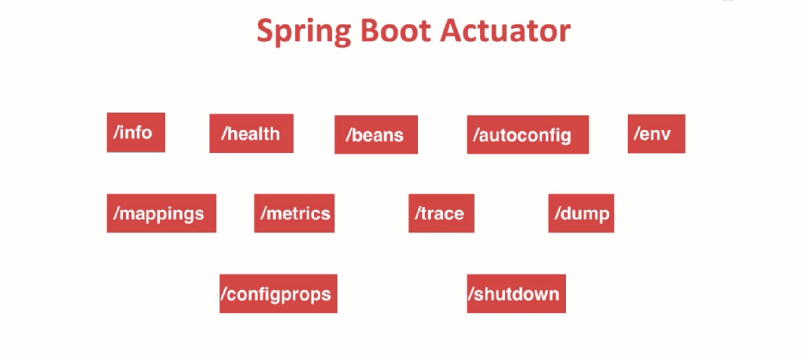

# SpringBoot-MVC-MyBatis-FreeMarker

##### localhost:8091/druid/index.html

##### /info:
代码里自定义的一些信息
##### /health:
健康监测url
##### /beans:
spring 容器里所有的bean
##### /autoconfig:
spring boot 自动配置和用户自定义配置
##### /env:
环境信息（系统、应用程序环境）
##### /mappings:
spring mvc url 到 controller方法映射
##### /metrics:
jvm，分段、分区使用比例，GC次数，内存信息等
##### /trace:
最近一段时间访问返回信息快照
##### /dump:
线程的所有信息
##### /configprops:
所有property的属性值
##### /shutdown:
如果配置endpoints.shutdown.enabled=true，那么可以通过浏览器shutdown

##### 访问 http://localhost:8092/actuator/health